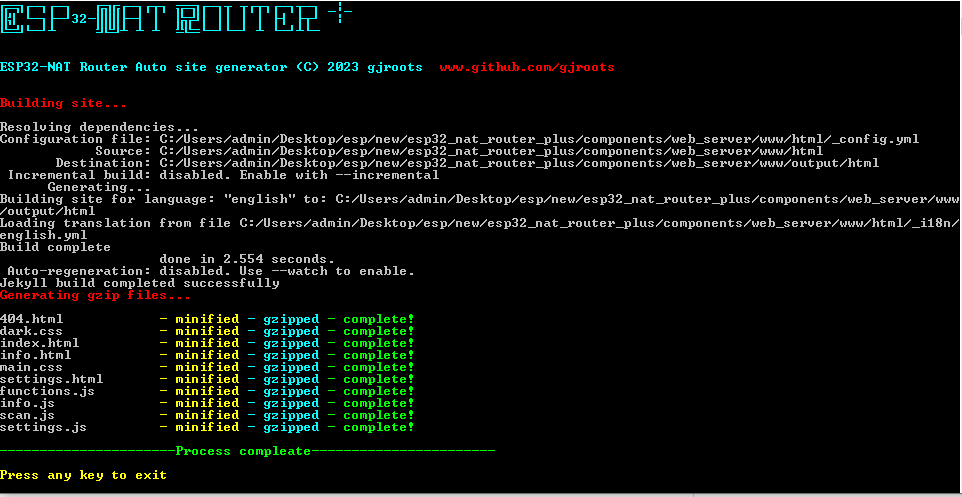

# ESP32-NAT Router +

## How to setup environment and build project

***Just a friendly reminder that building firmware for the ESP32-NAT Router + can be a bit challenging, so it's important to follow the documentation closely. However, as you dive deeper into the project, you'll discover and learn more interesting features to enjoy. Thank you for your interest in this project, and happy building!***

##### The software and technologies used in this project are varied and include but are not limited to:

1. Embedded C for programming the ESP32 microcontroller
2. Python for scripting and automation purposes
3. Ruby/jekyll for web development
4. HTML/CSS/JS for building the user interface of the router
5. Node.js runtime environment for creating `auto_generate.exe` for windows.
6. Bash/Bat scripting for executing various tasks and scripts 

### Prerequisites

Before diving into the project, there are several prerequisites that need to be installed:

 ***Note : Currently Supporting upto espidf 4.x.x and PltformIO : `PLATFORM: Espressif 32 (5.x.x)`***

- [VisualStudio Code](https://code.visualstudio.com/)
- [PlatformIO IDE for VSCode](https://platformio.org/install/ide?install=vscode)
- [Standard setup toolchain](https://docs.espressif.com/projects/esp-idf/en/latest/esp32/get-started/index.html#get-started-get-prerequisites) for your platform as outlined in the Espressif documentation 

If you plan to run a web server or build web interfaces, you will also need to install: 

- [Ruby](https://www.ruby-lang.org/)
- [Jekyll](https://jekyllrb.com/)

### Get Started

To clone this repository to your desired location, follow these steps:

- Navigate to your desired location using the command line interface using `cd` command.

- Run the command :
  
  `git clone https://github.com/gjroots/esp32_nat_router_plus.git`

- Once the repository has been cloned, you can open the project in Visual Studio Code and click on the "Start" button provided by PlatformIO.

- Please note that this may take some time as PlatformIO will download all the tools required for development. 

- Make your desired changes to the code and then click on "Compile and Upload" to upload your changes to the board.

*Until this stage, the instructions are common to any project when building firmware. However, if you want to make changes to the web interface, follow these steps:*

##### This project includes two Python scripts which offer special functionality through PlatformIO.

- `pre_extra_script.py` manages all setup to be up to date, gzips all built web interface files, updates the version, checks for any changes in the web interface, and auto builds, among other things. 
- `post_extra_script.py` manages everything after building the firmware, such as copying .bin files to the release folder, merging all bin's to a single bin file, and zipping all firmware files. 

These scripts are an important part of the project to automate some tasks to simple, and providing essential functionality to streamline the build process.

### WWW Folder

The `components/web_server/www` folder contains all the static files required for project's website. The `www/html` folder is the main folder within the `www` directory, where all the necessary site files are present

##### In our web interface building , we primarily use two folders:

 `components/web_server/html` and `components/web_server/output` . Once we have completed building the site, the files will appear in the `components/web_server/output/html` folder. To optimize the memory usage and increase the speed of site loading, we have converted all of the building site files into *gzip* files in`components/web_server/output/gzip` folder. This helps to reduce the overall size of the files and ensure that the site loads quickly and efficiently. 

### What is Jekyll?

[Jekyll](https://jekyllrb.com/) is a pre-compiler for static content generation that simplifies website maintenance. It uses Ruby to generate static HTML pages, which means that the outputted HTML is the same as if it were written by hand.

To start using Jekyll, you need to follow these steps:

- Install Ruby, Gem package manager & Jekyll ( check [here](https://www.ruby-lang.org/ ) )

- Run `bundle install` in the `components/web_server/html` folder to install dependencies

#### How to run a local server

Once Jekyll is installed, you can start a local server by following these steps:

- Run `bundle exec jekyll serve --watch` in the `components/web_server/html` folder

- Navigate to `http://127.0.0.1:4000` to see the website

- Changes made to files will be reflected in real-time, so you can test and make adjustments to your site's appearance and functionality. (make sure to refresh the page though)

- Alternatively, You can run the server, navigate to the root folder of the project and use `./start_web_server.sh` for Linux terminal or `start_web_server.bat` for Windows.

### How to update web-server files?

#### Build

- Building is a mandatory step after making changes. you can run the command `JEKYLL_ENV=production bundle exec jekyll build` for Linux Terminal  OR

   `set JEKYLL_ENV=production bundle exec jekyll build`  for Windows CMD  in the `components/web_server/html` folder to generate and return to production mode minified files.

- Alternatively, navigate to the root folder of the project and use `./build_web_pages.sh` in Linux terminal or `build_web_pages.bat` in Windows CMD.

#### Auto Mode

During the Auto Mode, the Python script monitors the `www/output/html` folder for any changes and automatically triggers the site build process and  files compress into the `www/output/gzip` folder. 

Note:  This process is only triggered when changes are made through the live server or run build manually, as Jekyll has two modes, namely the **development mode** and the **production mode**. After completing the development phase, the site is converted to production mode, where in the files are minified to enhance the site's loading speed.

##### Alternatively (Windows only)

- Make sure you have Jekyll & Gems installed (see above)

- Launch `auto_generate.exe` present in `www` folder 

- Wait for it to finish

- That's it **¯\_(ツ)_/¯**

**Note: These building steps are only necessary when changes have been made to the site files. Otherwise, these steps are not required.**

## Credit's

  [@samdenty](https://github.com/samdenty)/**[Wi-PWN](https://github.com/samdenty/Wi-PWN)** 

The UI code and concepts used in this project were developed by Sam Denty in the Wi-PWN project. By utilizing this user interface design and adapting it to the ESP32 NAT Router +, we are able to offer a user-friendly and intuitive interface to users. Thanks to Sam Denty's work, To provide a modern and responsive web interface.

##### Auto generate sample view
